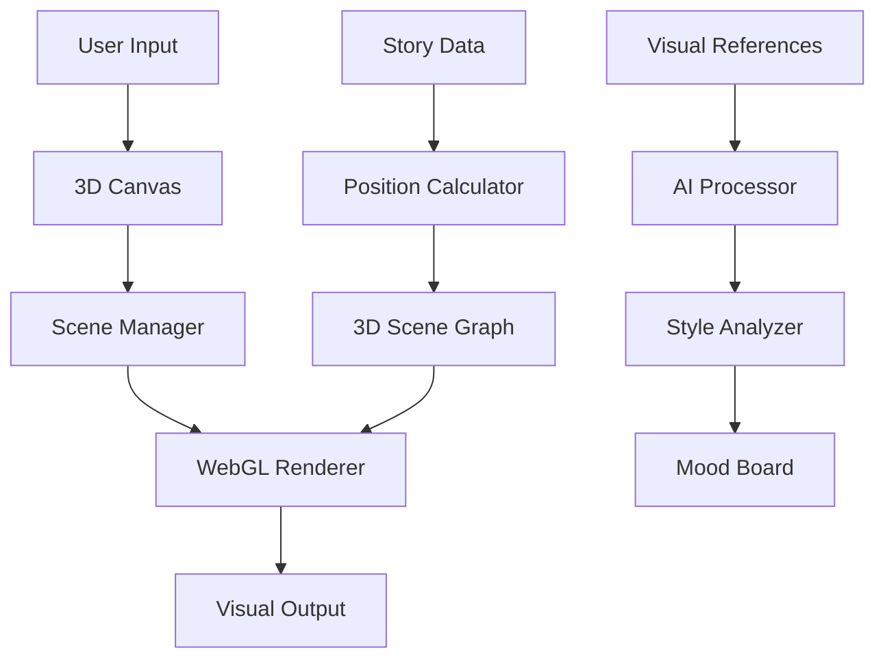

# ASTRAL_NOTES Visual Storytelling Implementation Roadmap
## Revolutionary 3D Story Visualization - Detailed Implementation Plan

### Overview

This roadmap outlines the phased implementation of revolutionary visual storytelling features that will transform ASTRAL_NOTES into the most visually innovative and creatively inspiring writing tool available. The implementation is designed to be backward-compatible while introducing cutting-edge 3D visualization and AI-powered creative tools.

## Phase 1: Foundation & Core Infrastructure (Months 1-2)

### 1.1 3D Rendering Infrastructure

**Dependencies Installation**
```bash
npm install three @react-three/fiber @react-three/drei @react-three/cannon
npm install leva react-spring @use-gesture/react
npm install @tensorflow/tfjs color-thief
```

**Core 3D Components Development**

1. **Plot3DCanvas.tsx** ✅ *[CREATED]*
   - WebGL-powered 3D scene rendering
   - Multi-dimensional axis mapping
   - Interactive camera controls
   - Performance optimization with LOD

2. **Scene3DNode.tsx** *[NEXT]*
   - 3D scene representation with dynamic styling
   - Particle effects for emotional intensity
   - Interactive hover and selection states
   - Smooth animations and transitions

3. **Connection3D.tsx** *[NEXT]*
   - 3D connection visualization between scenes
   - Dynamic line rendering with physics
   - Connection type styling and animations
   - Interactive connection editing

4. **TensionSurface.tsx** *[NEXT]*
   - Volumetric tension field rendering
   - Height-based tension visualization
   - Dynamic color mapping
   - Interactive surface exploration

### 1.2 Enhanced Data Models

**Type Extensions** *[Priority: HIGH]*
```typescript
// Add to existing story.ts types
interface Scene3DProperties {
  position3D: Vector3D;
  visualStyle: SceneVisualStyle;
  particles: ParticleEffect[];
  lighting: LightingConfig;
  animations: Animation3D[];
}

interface VisualReference {
  id: string;
  type: 'image' | 'color' | 'texture' | 'style';
  url?: string;
  data: string | object;
  appliedTo: string[];
  metadata: VisualMetadata;
}
```

### 1.3 Inspiration Hub Infrastructure

1. **InspirationHub.tsx** ✅ *[CREATED]*
   - Visual reference management
   - AI generation integration
   - Mood board creation
   - Category-based organization

2. **MoodBoardCanvas.tsx** *[NEXT]*
   - Infinite canvas for visual arrangement
   - Drag-and-drop functionality
   - Real-time collaboration
   - Export capabilities

3. **VisualStyleGenerator.tsx** *[NEXT]*
   - AI-powered image generation
   - Character appearance creation
   - Location visualization
   - Style consistency tools

### 1.4 Backend API Extensions

**New Endpoints** *[Priority: HIGH]*
```typescript
// Visual references
POST   /api/visual-references
GET    /api/visual-references/project/:projectId
PUT    /api/visual-references/:id
DELETE /api/visual-references/:id

// Mood boards
POST   /api/mood-boards
GET    /api/mood-boards/project/:projectId
PUT    /api/mood-boards/:id

// AI generation
POST   /api/ai/generate-image
POST   /api/ai/extract-colors
POST   /api/ai/analyze-mood
```

**Database Schema Updates**
```sql
CREATE TABLE visual_references (
  id UUID PRIMARY KEY,
  project_id UUID REFERENCES projects(id),
  type VARCHAR(20) NOT NULL,
  title VARCHAR(255) NOT NULL,
  url TEXT,
  metadata JSONB,
  tags TEXT[],
  created_at TIMESTAMP DEFAULT NOW()
);

CREATE TABLE mood_boards (
  id UUID PRIMARY KEY,
  project_id UUID REFERENCES projects(id),
  title VARCHAR(255) NOT NULL,
  canvas_data JSONB,
  is_public BOOLEAN DEFAULT FALSE,
  created_at TIMESTAMP DEFAULT NOW()
);
```

## Phase 2: Core 3D Features (Months 3-4)

### 2.1 Advanced 3D Visualizations

1. **CharacterJourney3D.tsx** *[Priority: HIGH]*
   - Character arc pathway visualization
   - Emotional state color coding
   - Transformation point highlighting
   - Interactive journey exploration

2. **StoryFlowCanvas.tsx** *[Priority: HIGH]*
   - Organic narrative flow visualization
   - Causal relationship mapping
   - Interactive flow editing
   - Real-time flow analysis

3. **Timeline3D.tsx** *[Priority: MEDIUM]*
   - Helical timeline for complex narratives
   - Braided timelines for multiple storylines
   - Temporal portal visualization
   - Interactive time navigation

### 2.2 Enhanced Tension Visualization

1. **TensionHeatmap3D.tsx**
   - Volumetric tension rendering
   - Multi-layered analysis views
   - Interactive tension editing
   - Temporal animation

2. **PacingFlowVisualization.tsx**
   - River-like pacing visualization
   - Dynamic obstacle representation
   - Character navigation tracking
   - Flow velocity indicators

### 2.3 AI Integration

1. **AI Service Integration**
   - OpenAI DALL-E API integration
   - Stable Diffusion local deployment
   - Color palette extraction
   - Mood analysis algorithms

2. **Character Appearance Generation**
   - AI-powered character visualization
   - Consistency checking across scenes
   - Style transfer capabilities
   - Reference image processing

## Phase 3: Advanced Features & Polish (Months 5-6)

### 3.1 Multi-Dimensional Analysis

1. **DimensionMapper.tsx**
   - Dynamic axis configuration
   - Real-time dimension switching
   - Statistical visualization
   - Correlation analysis

2. **StoryAnalytics3D.tsx**
   - Multi-dimensional story metrics
   - Trend visualization
   - Anomaly detection
   - Predictive insights

### 3.2 Collaborative Features

1. **Real-time Collaboration**
   - Multi-user 3D cursor tracking
   - Shared visual references
   - Collaborative mood boards
   - Version control for visuals

2. **Social Features**
   - Public mood board sharing
   - Community visual library
   - Inspiration marketplace
   - Creator showcases

### 3.3 Export & Integration

1. **Advanced Export Options**
   - 3D scene export to glTF/GLB
   - High-resolution render exports
   - Interactive HTML exports
   - VR/AR ready formats

2. **External Tool Integration**
   - Blender scene export
   - Unity/Unreal integration
   - Adobe Creative Suite plugins
   - Film pre-visualization tools

## Technical Implementation Details

### 3D Rendering Performance

**Optimization Strategies**
- Level-of-detail (LOD) system for scene complexity
- Frustum culling for off-screen elements
- Instance rendering for similar objects
- Texture atlas optimization
- Shader compilation caching

**Memory Management**
- Object pooling for frequent creations/destructions
- Garbage collection optimization
- Progressive asset loading
- Background texture compression

### AI Integration Architecture

**Local Processing**
```typescript
// TensorFlow.js for client-side processing
import * as tf from '@tensorflow/tfjs';

class VisualAnalyzer {
  async extractColors(imageData: ImageData): Promise<string[]> {
    // Color extraction using ColorThief
  }
  
  async analyzeMood(imageData: ImageData): Promise<MoodAnalysis> {
    // Sentiment analysis using pre-trained models
  }
  
  async detectStyle(imageData: ImageData): Promise<StyleAnalysis> {
    // Style classification using CNN
  }
}
```

**Cloud Processing**
```typescript
// AI generation service integration
class AIGenerationService {
  async generateImage(prompt: AIPrompt): Promise<GeneratedImage> {
    // DALL-E or Midjourney API integration
  }
  
  async enhanceImage(image: string, enhancement: Enhancement): Promise<string> {
    // Image enhancement and upscaling
  }
}
```

### Data Flow Architecture



## Quality Assurance Plan

### Testing Framework

1. **Visual Regression Testing**
   - Automated screenshot comparison
   - Cross-browser compatibility testing
   - Performance benchmark monitoring
   - Memory leak detection

2. **User Experience Testing**
   - Usability studies with writers
   - A/B testing for interface elements
   - Accessibility compliance testing
   - Mobile responsiveness validation

3. **Performance Testing**
   - 3D rendering performance benchmarks
   - Large project handling tests
   - Multi-user collaboration stress tests
   - Memory usage optimization validation

### Browser Compatibility

**Supported Browsers**
- Chrome 90+ (Primary development target)
- Firefox 88+
- Safari 14+
- Edge 90+

**WebGL Requirements**
- WebGL 2.0 support required
- Hardware acceleration enabled
- Minimum 4GB system RAM recommended
- Dedicated graphics card recommended for complex scenes

## Deployment Strategy

### Progressive Rollout

1. **Alpha Release (Internal Testing)**
   - Core team testing with selected projects
   - Performance optimization
   - Critical bug fixes

2. **Beta Release (Closed Beta)**
   - 100 selected power users
   - Feature feedback collection
   - Performance monitoring
   - Edge case identification

3. **Production Release (Gradual Rollout)**
   - 10% of users initially
   - Monitoring for stability issues
   - Gradual increase to 100%
   - Feature flag controls for instant rollback

### Feature Flags

```typescript
interface FeatureFlags {
  enable3DPlotboard: boolean;
  enableAIGeneration: boolean;
  enableMoodBoards: boolean;
  enableCharacterJourneys: boolean;
  enableTensionHeatmaps: boolean;
  enableCollaborativeVisuals: boolean;
}
```

## Resource Requirements

### Development Team

**Core Team (6 months)**
- 2 Senior Frontend Developers (React/Three.js expertise)
- 1 3D Graphics Specialist
- 1 UI/UX Designer (3D interface experience)
- 1 Backend Developer (API extensions)
- 1 DevOps Engineer (deployment and monitoring)
- 1 QA Engineer (visual testing expertise)

**External Resources**
- AI/ML consultant for generation features
- 3D artist for visual style development
- Technical writer for documentation

### Infrastructure

**Additional Costs**
- AI generation API credits (estimated $500-2000/month)
- Additional CDN bandwidth for visual assets
- GPU-enabled servers for AI processing
- Enhanced monitoring and analytics tools

### Budget Estimation

```
Development Team (6 months): $400,000
External Consultants: $50,000
Infrastructure Setup: $25,000
AI API Credits (6 months): $6,000
Tools and Licenses: $15,000
---
Total Estimated Cost: $496,000
```

## Success Metrics

### User Engagement

- **3D Feature Adoption Rate**: Target 60% of active users within 3 months
- **Session Duration**: Increase average session time by 40%
- **Feature Retention**: 70% of users return to visual features within 30 days
- **Creative Output**: 25% increase in story complexity metrics

### Technical Performance

- **3D Render Performance**: Maintain 60fps on recommended hardware
- **Load Time**: Initial 3D scene load under 3 seconds
- **Memory Usage**: Stay under 1GB for typical projects
- **Error Rate**: Less than 0.1% of 3D operations fail

### Business Impact

- **User Satisfaction**: Net Promoter Score increase by 20 points
- **Premium Conversions**: 15% increase in premium subscription rate
- **User Retention**: Reduce churn rate by 25%
- **Market Position**: Establish as #1 visual writing tool

## Risk Management

### Technical Risks

1. **WebGL Compatibility Issues**
   - **Mitigation**: Comprehensive fallback systems, graceful degradation
   - **Contingency**: 2D visualization alternatives

2. **Performance on Lower-end Devices**
   - **Mitigation**: Adaptive quality settings, mobile optimization
   - **Contingency**: Progressive enhancement approach

3. **AI Generation API Limits**
   - **Mitigation**: Local processing alternatives, usage quotas
   - **Contingency**: Partnership with multiple AI providers

### Business Risks

1. **User Adoption Slower than Expected**
   - **Mitigation**: Comprehensive onboarding, tutorial system
   - **Contingency**: Enhanced marketing, user education program

2. **Competitor Response**
   - **Mitigation**: Rapid innovation cycles, patent applications
   - **Contingency**: Focus on execution quality and user experience

## Conclusion

This implementation roadmap represents a revolutionary advancement in visual storytelling tools. By combining cutting-edge 3D visualization, AI-powered creativity assistance, and intuitive user interfaces, ASTRAL_NOTES will become the definitive platform for visually-enhanced creative writing.

The phased approach ensures stability while introducing groundbreaking features that will set new industry standards. With proper execution, this roadmap will position ASTRAL_NOTES as the most innovative and visually sophisticated writing tool available, attracting creators who demand both powerful functionality and inspiring visual experiences.

The investment in this visual storytelling architecture will pay dividends through increased user engagement, higher conversion rates, and establishment of ASTRAL_NOTES as the premium choice for serious writers and creators who value both narrative depth and visual inspiration.